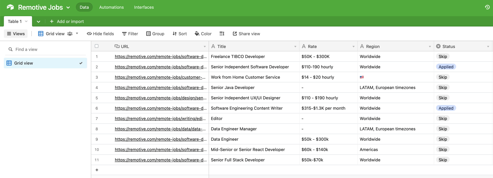
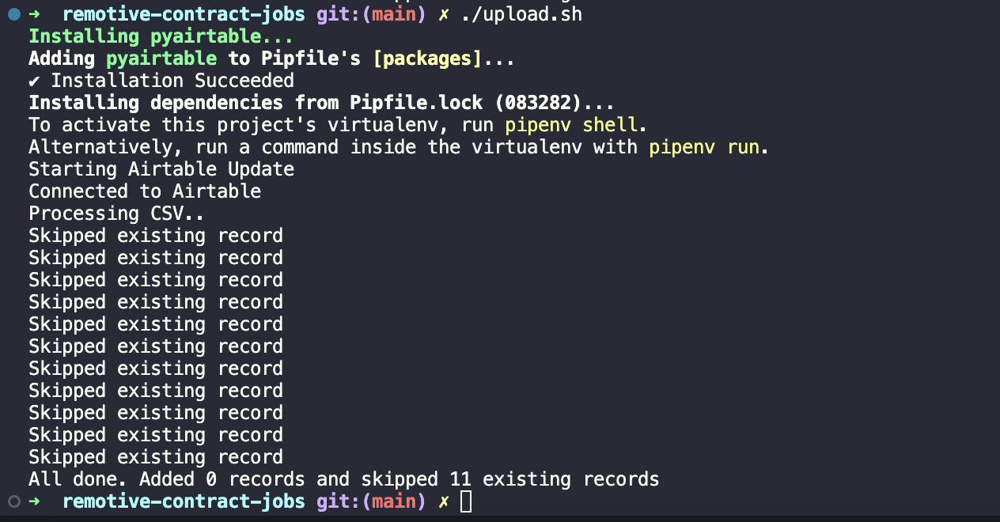

# remotive-contract-jobs

[https://remotive.com/](https://remotive.com/) has a job board for remote jobs but, the filtering on this page isn't great.

Specifically, I wanted to find only jobs open for contractors and freelancers. So this scraper pulls down the most recent page and filters out the roles that are contract.

## running it

Just run `run.sh`. The scraper is configured to store all responses in a local cache to avoid loading the remotive.com if you adjust the scraping content.

Output will be placed in `output/jobs.csv`.

After export, you can upload it to an Airtable base if you like by running `upload.sh`. It will ask you for the required Airtable credentials.

## usage

I imported the export into Airtable where I can manage the walkthrough status.

## next steps

Nothing planned.